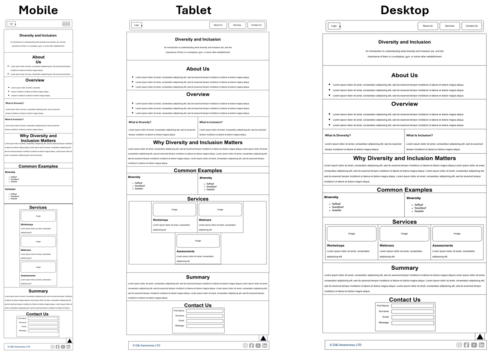
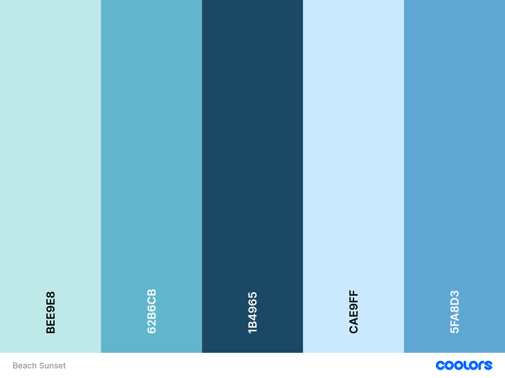

# Introduction
The name of this website is D&I and is being developed as part of Code Institutes "Individual Formative Assignment" which is part of the AI Augmented FullStack Bootcamp. The purpose of the website is to give the user a comprehensive and in-depth look at what diversity and inclusion are, why they are important, how they can impact workplace environments and some real-world examples of them. A mobile-first approach is taken to develop the application.

# UX/UI Study

## User Stories 

### Website Purpose (Must Have)

**User Story**

As a visitor, I want to understand the purpose of the website immediately so that I know what information it provides.

**Acceptance Criteria**

- **Given** I visit the homepage, **when** the page loads, **then** I see a clear title describing the website.
- **Given** the homepage is displayed, **when** I read the introduction, **then** I understand the purpose of the website within the first screen.
- **Given** I arrive on the page, **when** the content is displayed, **then** the introduction is concise and easy to understand.

### Navigation (Must Have)

**User Story**

As a visitor, I want to navigate easily between sections of the page so that I can quickly find the information I need.

**Acceptance Criteria**

- **Given** I am viewing the page, **when** I select a navigation link, **then** I am taken to the corresponding section.
- **Given** I am using a keyboard, **when** I tab through the navigation, **then** every navigation link is accessible.
- **Given** I select a navigation item, **when** the page scrolls, **then** the movement is smooth.

### Responsive Design (Must Have)

**User Story**

As a visitor, I want the website to work well on desktops, tablets, and mobile devices so that I can access it from any device.

**Acceptance Criteria**

- The website displays correctly on mobile, tablet, and desktop screen sizes.
- Text remains readable without horizontal scrolling.
- Images scale proportionally.
- Navigation remains usable on all devices.

### Understanding Diversity (Must Have)

**User Story**

As a learner, I want to read a clear definition of diversity so that I understand what the term means

**Acceptance Criteria**

- A dedicated Diversity section exists.
- The section includes a clear definition of diversity.
- The section includes at least three examples of different forms of diversity.
- The content is written in plain English.

### Understanding Inclusion (Must Have)

**User Story**

As a learner, I want to read a simple definition of inclusion so that I understand how it differs from diversity

**Acceptance Criteria**

- A dedicated Inclusion section exists.
- The section explains how inclusion differs from diversity.
- The section provides at least three examples of inclusive behaviours.
- The explanation is understandable without specialist knowledge.

### Importance of Diversity and Inclusion (Must Have)

**User Story**

As a visitor, I want to understand why diversity and inclusion are important so that I appreciate their benefits

**Acceptance Criteria**

- The website contains a section explaining the benefits.
- The section includes benefits for:
  - individuals
  - organisations
  - communities
- At least one real-world example is included.

### Real-World Examples (Should Have) 

**User Story**

As a learner, I want to see real-world examples so that I can relate the concepts to everyday situations

**Acceptance Criteria**

- Examples are provided from at least three different settings.
- Each example explains both diversity and inclusion.
- Examples are relevant and easy to understand.

### Accessibility (Should Have)

**User Story**

As a user with accessibility needs, I want the website to follow accessibility best practices so that I can access all of the content

**Acceptance Criteria**

- All images contain meaningful alternative text.
- Headings follow a logical hierarchy.
- Colour contrast meets WCAG AA standards.
- Every interactive element is keyboard accessible.
- The page uses semantic HTML5 elements.

### Visual Design (Must Have)

**User Story**

As a visitor, I want the website to be visually appealing so that I enjoy exploring the content.

**Acceptance Criteria**

- A consistent colour palette is used.
- Typography is consistent across the website.
- Images complement the content.
- Spacing and alignment are consistent throughout.

### Statistics (Could Have)

**User Story**

As a visitor, I want a section containing facts or statistics so that I can understand the impact of diversity and inclusion.

**Acceptance Criteria**

- The page contains a Facts & Statistics section.
- At least three relevant statistics are displayed.
- Every statistic includes its source.
- Statistics are presented in an easy-to-read format.

### External Resources (Could Have)

**User Story**

As a visitor, I want links to trusted external resources so that I can continue learning.

**Acceptance Criteria**

- At least three external resources are provided.
- Links open in a new browser tab.
- Each link includes a brief description.
- All links are functional.

### Summary Section (Should Have)

**User Story**

As a visitor, I want a summary at the end of the page so that I can review the main learning points.

**Acceptance Criteria**

- A summary section appears at the bottom of the page.
- The summary highlights the key concepts covered.
- The summary encourages users to continue learning.

### HTML5 Structure (Must Have)

**User Story**

As a user, I want the website to use semantic HTML5 elements so that the content is well structured and accessible.

**Acceptance Criteria**

- The page uses:
  - &lt;header&gt;
  - &lt;nav&gt;
  - &lt;main&gt;
  - &lt;section&gt;
  - &lt;article&gt; (where appropriate)
  - &lt;footer&gt;
- Only one &lt;h1&gt; element exists.
- Heading levels follow a logical hierarchy.

## Strategy Plane

### Target Audience
This website is aimed at students, employees, educators, and members of the general public who want to develop a basic understanding of diversity and inclusion. It is designed for users with little or no prior knowledge, presenting information in a clear, accessible, and engaging way using responsive HTML5 and CSS3 design principles. 

### User Needs

The target audience needs to:

* Understand the definitions of diversity and inclusion.
* Recognise the differences between the two concepts.
* Learn why diversity and inclusion are important in society, education, and the workplace.
* Discover practical examples of inclusive behaviour.
* Access reliable information presented in an easy-to-navigate, accessible format.

## The Scope Plane

### Functional Requirements

Functional requirements describe what the website must do to meet the needs of its users.

**Must Have**
* Homepage with introduction
* Navigation menu
* Diversity section
* Inclusion section
* Benefits section
* Responsive layout
* Accessible design
* Semantic HTML5 structure
* External CSS stylesheet
* Footer

**Should Have**
* Smooth scrolling navigation
* Facts and statistics section
* Real-world examples
* Relevant images and icons
* Hover and focus effects

**Could Have**

* Back-to-top button
* Animated section transitions using CSS
* Timeline of diversity and inclusion milestones
* Frequently Asked Questions (FAQ) section
* Embedded video explaining diversity and inclusion

## The Skeleton Plane

### Wireframes

## The Surface Plane

### Color Pallete Used

### Imagery
* Icons have been used to represent social media links in the footer 
* A logo has been created to represent the site and is placed on the left-side of the header

### Typography
* font-family: Arial, Helvetica, sans-serif;