## Introduction

This document outlines the testing of various different aspects of the application. This include:
* Code validation using HTML5 and CSS3 Validators
* Lighthouse testing
* Responsiveness testing
* Cross-browser compatibility
* Form validation testing
* User story testing

## HTML5 and CSS3 Code Validation

### HTML5 Validation

**Before**
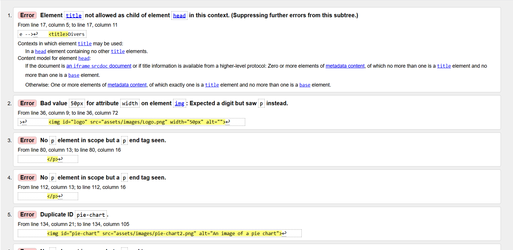

**After**
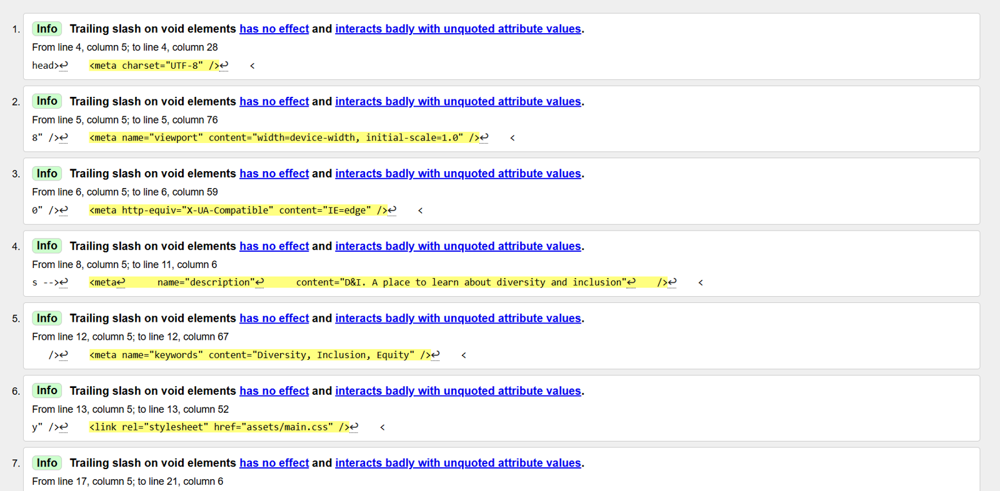

### CSS3 Validation

**Before**
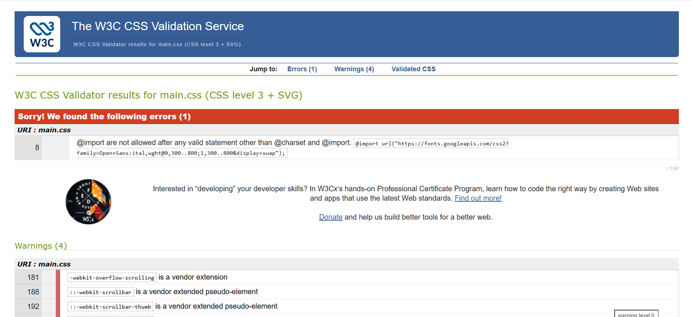

**After**
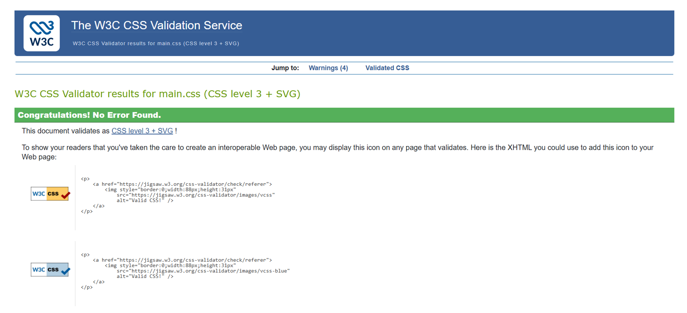

## Lighthouse Testing

### Mobile 
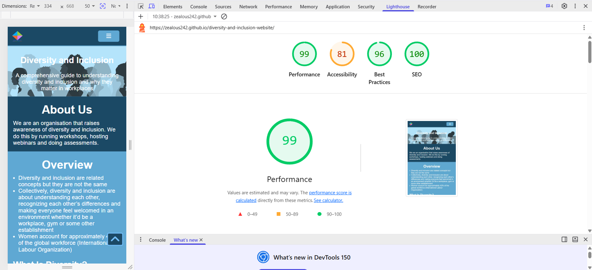

### Desktop
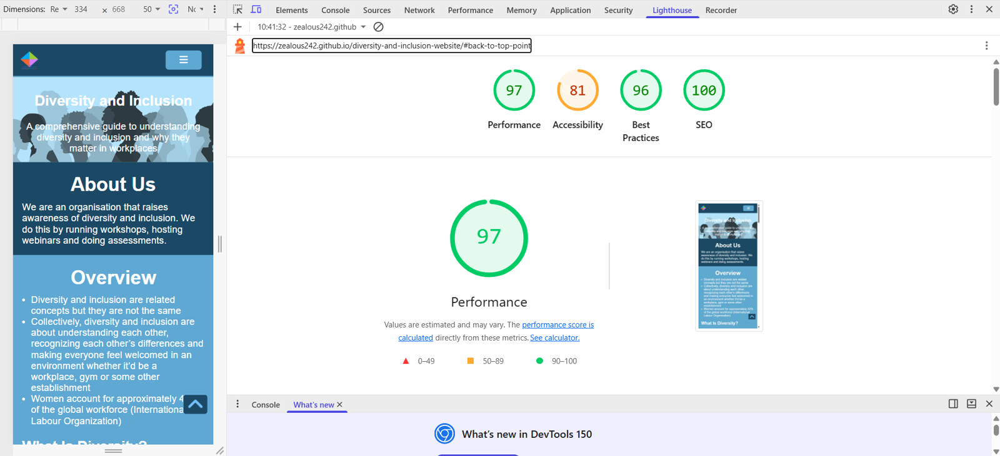

## Responsiveness Testing

### Mobiles (320px x 614px)
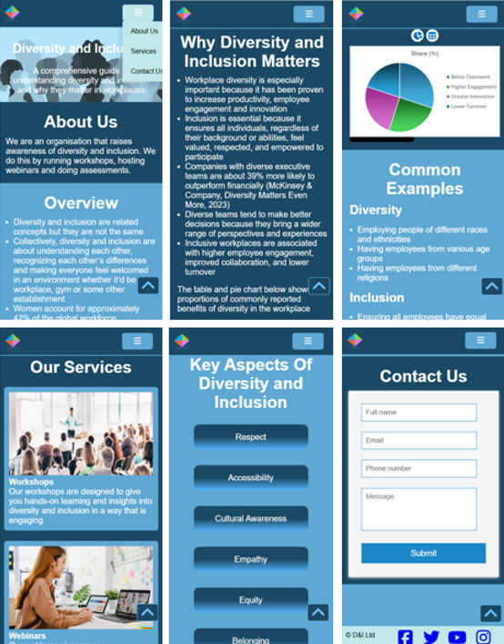

### Tablets (768px x 614px)
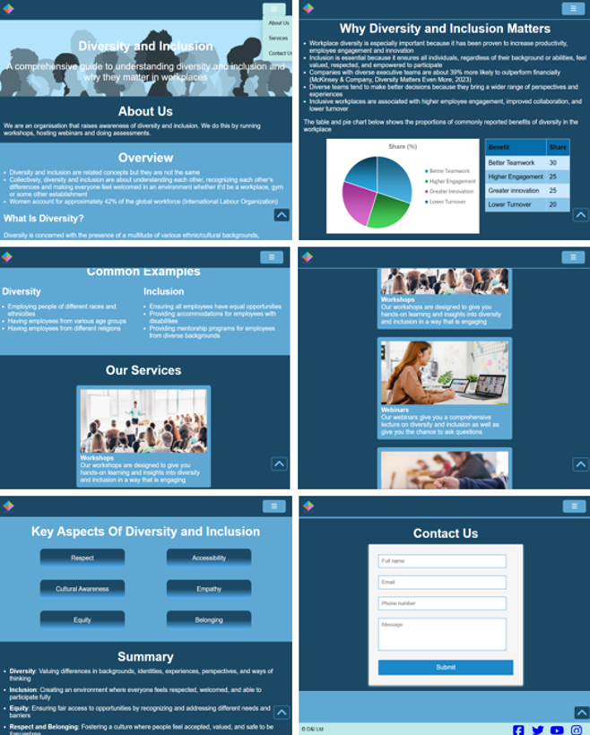

### Laptops and larger screens (1024px x 614px)
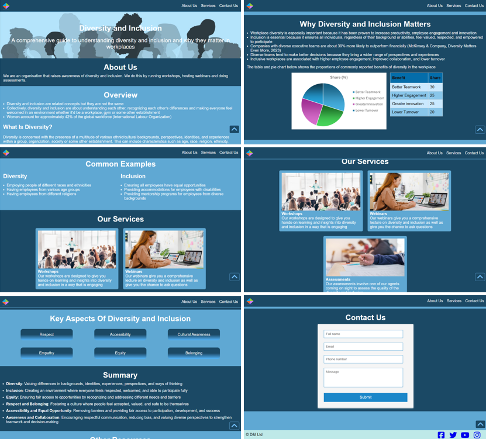

## Browser Comptibility

### Chrome

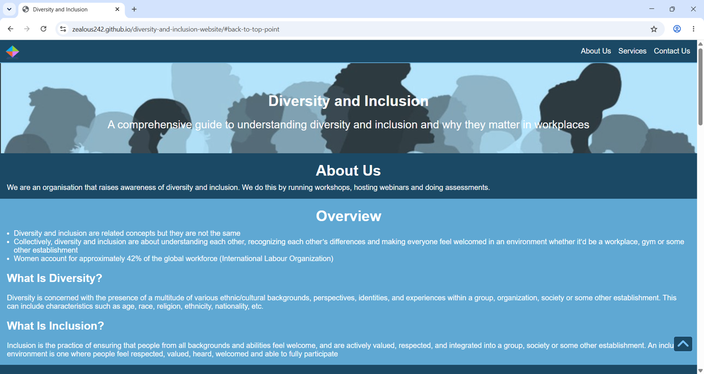

### Firefox

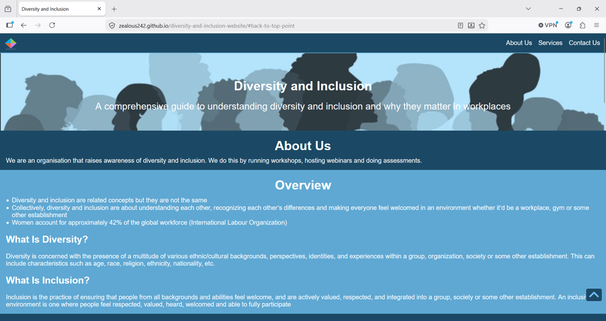

### Microsoft Edge

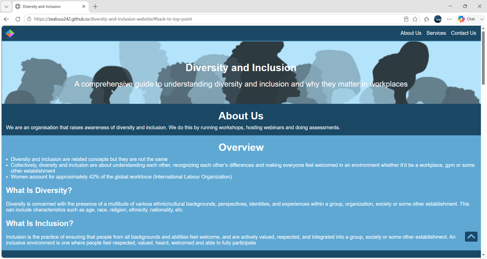

## Form Validation Testing

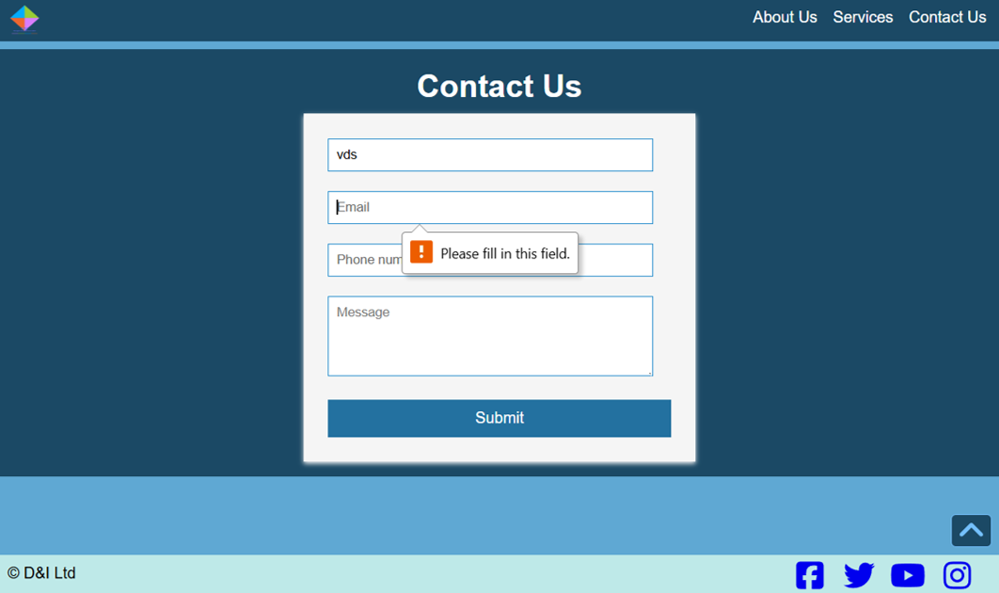

## User Story Testing

### Responsive Design (Must Have) 

**User Story:**

As a visitor, I want the website to work well on desktops, tablets, and mobile devices so that I can access it from any device.

**Met?** Yes

**Evidence:**

See responsiness testing section above

### Understanding Diversity (Must Have)

**User Story:**

As a learner, I want to read a clear definition of diversity so that I understand what the term means

**Met?** Yes

**Evidence:**

### Understanding Inclusion (Must Have)

**User Story:**

As a learner, I want to read a simple definition of inclusion so that I understand how it differs from diversity

**Met?** Yes

**Evidence:**

### Importance of Diversity and Inclusion (Must Have)

**User Story:**

As a visitor, I want to understand why diversity and inclusion are important so that I appreciate their benefits

**Met?** Yes

**Evidence:**
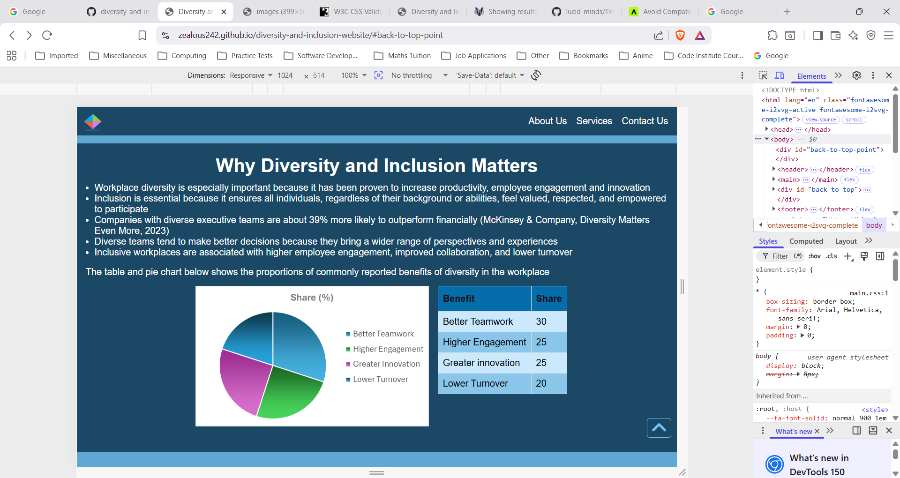

### Real-World Examples (Should Have) 

**User Story:**

As a learner, I want to see real-world examples so that I can relate the concepts to everyday situations

**Met?** Yes

**Evidence:**
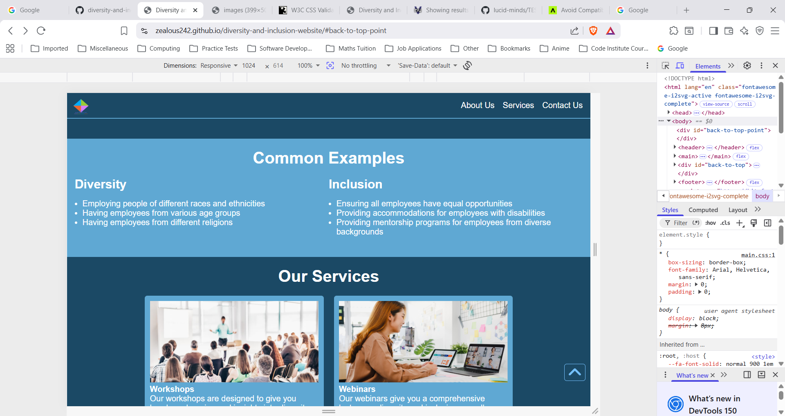

### Accessibility (Should Have)

**User Story:**

As a user with accessibility needs, I want the website to follow accessibility best practices so that I can access all of the content

**Met?** Mostly

**Evidence**: See Lighthouse testing score for accessibility above

### Visual Design (Must Have)

**User Story:**

As a visitor, I want the website to be visually appealing so that I enjoy exploring the content.

**Met?** Yes

**Evidence:** See any screenshot and responsiveness testing

### Statistics (Could Have)

**User Story:**

As a visitor, I want a section containing facts or statistics so that I can understand the impact of diversity and inclusion.

**Met?** Yes

**Evidence**:

### External Resources (Could Have)

**User Story:**

As a visitor, I want links to trusted external resources so that I can continue learning.

**Met?** Yes

**Evidence:**
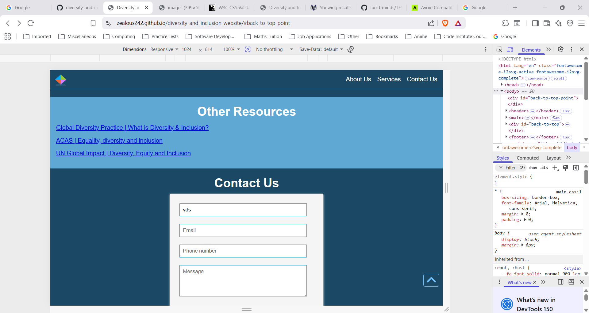

### Summary Section (Should Have)

**User Story:**

As a visitor, I want a summary at the end of the page so that I can review the main learning points.

**Met?** Yes

**Evidence:**
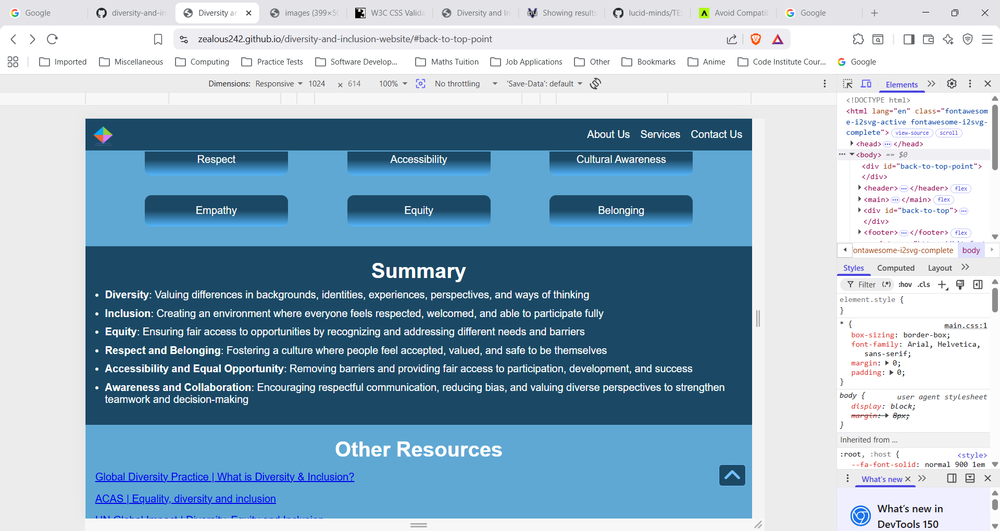

### HTML5 Structure (Must Have)

**User Story:**

As a user, I want the website to use semantic HTML5 elements so that the content is well structured and accessible.

**Met?** Yes

**Evidence:** See index.html
